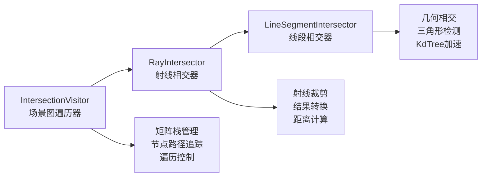
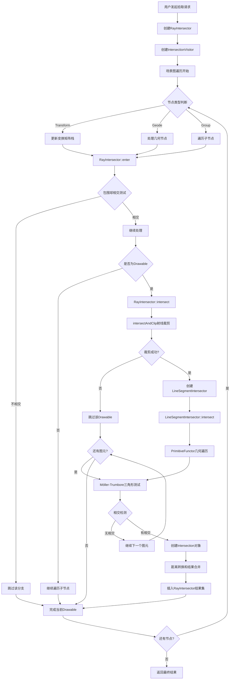
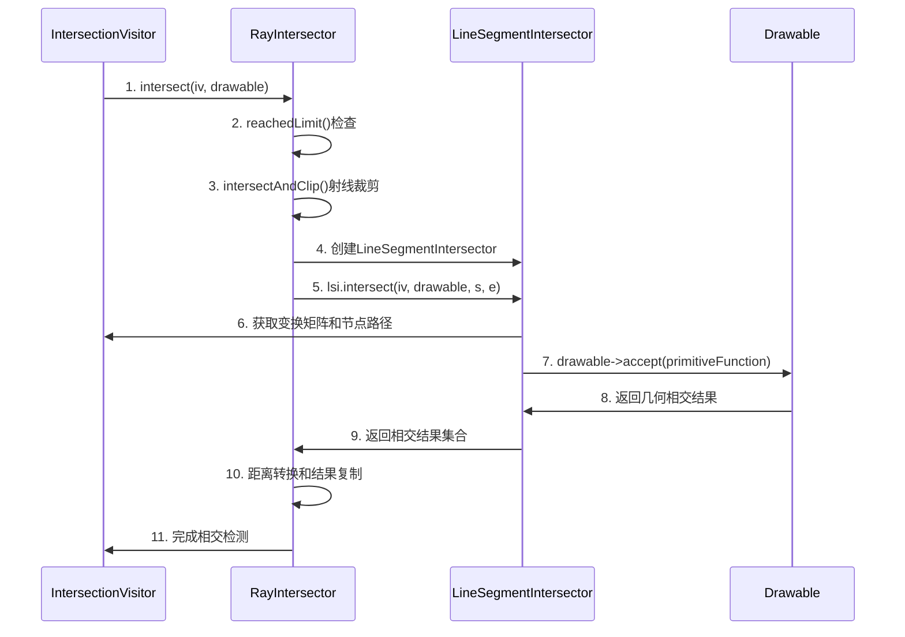
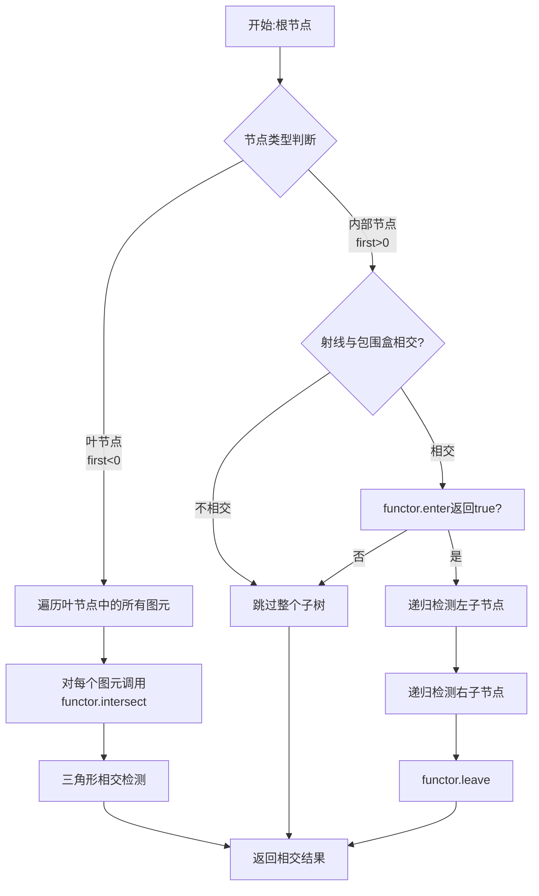

# OpenSceneGraph 相交拾取流程详解


## 概述

OpenSceneGraph的相交拾取系统是一个分层的、高效的3D场景交互解决方案。该系统通过RayIntersector、LineSegmentIntersector和IntersectionVisitor的协同工作，实现了从射线定义到最终相交结果的完整流程。本文以RayIntersector为例，详细剖析整个相交拾取的执行流程。

## 拾取流程核心组件

### 三大核心组件



### 关键数据结构

#### RayIntersector核心成员
```cpp
osg::Vec3d _start;              // 射线起点
osg::Vec3d _direction;          // 射线方向
Intersections _intersections;   // 相交结果集合
```

#### 相交结果结构
```cpp
struct Intersection {
    double distance;                        // 从射线起点到相交点的距离
    osg::NodePath nodePath;                // 场景图路径
    osg::ref_ptr<osg::Drawable> drawable;  // 相交的几何对象
    osg::Vec3d localIntersectionPoint;     // 局部坐标相交点
    osg::Vec3 localIntersectionNormal;     // 局部坐标法线
    // ... 其他详细信息
};
```

## 完整拾取流程概览

### 流程总览图



### 五大核心阶段

1. **初始化阶段**：创建射线相交器和访问者
2. **场景遍历阶段**：IntersectionVisitor遍历场景图
3. **包围体测试阶段**：快速剔除不相交的节点
4. **几何相交阶段**：RayIntersector执行具体相交检测
5. **结果汇总阶段**：收集和排序所有相交结果

## 各阶段详细分析

### 阶段1：初始化阶段

#### 射线定义方式

```cpp
// 方式1：直接指定起点和方向（无限射线）
RayIntersector(const Vec3d& start, const Vec3d& direction);

// 方式2：屏幕坐标拾取（自动转换为射线）
RayIntersector(CoordinateFrame cf, double x, double y);
```

#### 坐标框架自动转换
```cpp
switch(cf) {
    case WINDOW:     setStart(Vec3d(x,y,0.));  setDirection(Vec3d(0.,0.,1.)); break;
    case PROJECTION: setStart(Vec3d(x,y,-1.)); setDirection(Vec3d(0.,0.,1.)); break;
    case VIEW:       setStart(Vec3d(x,y,0.));  setDirection(Vec3d(0.,0.,1.)); break;
    case MODEL:      setStart(Vec3d(x,y,0.));  setDirection(Vec3d(0.,0.,1.)); break;
}
```

### 阶段2：场景遍历阶段

#### 访问者模式遍历
IntersectionVisitor基于访问者模式遍历场景图，为每个节点类型提供专门的处理：
- **Transform节点**：更新变换矩阵栈
- **Group节点**：递归遍历子节点  
- **Drawable节点**：执行几何相交检测

#### 动态克隆机制

```cpp
Intersector* RayIntersector::clone(IntersectionVisitor& iv) {
    // 根据当前变换矩阵创建新的相交器实例
    Matrix matrix(LineSegmentIntersector::getTransformation(iv, _coordinateFrame));
    Vec3d newStart = _start * matrix;
    Vec4d tmp = Vec4d(_start + _direction, 1.) * matrix;
    Vec3d newEnd = Vec3d(tmp.x(), tmp.y(), tmp.z()) - (newStart * tmp.w());
    return new RayIntersector(MODEL, newStart, newEnd, this, _intersectionLimit);
}
```

### 阶段3：包围体测试阶段

#### 节点筛选策略
```cpp
bool RayIntersector::enter(const Node& node) {
    if (reachedLimit()) return false;  // 检查相交限制
    return !node.isCullingActive() || intersects(node.getBound());  // 包围球测试
}
```

#### 包围球相交算法
射线与包围球的快速相交测试是性能优化的关键：

```cpp
bool RayIntersector::intersects(const BoundingSphere& bs) {
    if (!bs.valid()) return true;
    
    // 1.测试起点是否在包围球内
    Vec3d sm = _start - bs._center;
    double c = sm.length2() - bs._radius * bs._radius;
    if (c<0.0) return true;
    
    // 2.求解二次方程
    double a = _direction.length2();
    double b = (sm * _direction) * 2.0;
    double d = b * b - 4.0 * a * c;
    
    if (d<0.0) return false;  // 无相交
    
    // 3.计算两个解
    d = sqrt(d);
    double div = 1.0/(2.0*a);
    double r1 = (-b-d)*div;
    double r2 = (-b+d)*div;
    // 如果两个相交点都在射线起点之前，返回false
    if (r1<=0.0 && r2<=0.0) return false;
    return true;
}
```

**数学原理**：
- **射线方程**：$\mathbf{P}(t) = \mathbf{start} + t \cdot \mathbf{direction}$
- **球面方程**：$|\mathbf{P}(t) - \mathbf{center}|^2 = r^2$
- **二次方程**：$a t^2 + b t + c = 0$，其中：
  - $a = |\mathbf{direction}|^2$
  - $b = 2(\mathbf{sm} \cdot \mathbf{direction})$  
  - $c = |\mathbf{sm}|^2 - r^2$
- **判别式**：$D = b^2 - 4ac$
- **相交条件**：$D \geq 0$ 且至少有一个解 $t \geq 0$

### 阶段4：几何相交阶段

#### RayIntersector::intersect 核心流程

这是整个拾取系统的核心环节：

```cpp
void RayIntersector::intersect(IntersectionVisitor& iv, Drawable* drawable) {
    // 1. 检查相交限制
    if (reachedLimit()) return;
    
    // 2. 射线裁剪：将无限射线转换为有限线段
    Vec3d s(_start), e;
    if (!intersectAndClip(s, _direction, e, drawable->getBoundingBox())) return;
    
    // 3. 检查是否为虚拟遍历
    if (iv.getDoDummyTraversal()) return;
    
    // 4. 委托给LineSegmentIntersector进行实际相交检测
    LineSegmentIntersector lsi(MODEL, s, e, NULL, _intersectionLimit);
    lsi.setPrecisionHint(getPrecisionHint());
    lsi.intersect(iv, drawable, s, e);
    
    // 5. 处理相交结果：距离转换和数据复制
    LineSegmentIntersector::Intersections intersections = lsi.getIntersections();
    if (!intersections.empty()) {
        double preLength = (s - _start).length();  // 裁剪起点到原射线起点的距离
        double esLength = (e - s).length();        // 裁剪后线段的长度
        
        for(auto it = intersections.begin(); it != intersections.end(); it++) {
            Intersection hit;
            // 关键：将LineSegmentIntersector的ratio转换为RayIntersector的distance
            hit.distance = preLength + it->ratio * esLength;
            
            // 复制其他相交信息
            hit.matrix = it->matrix;
            hit.nodePath = it->nodePath;
            hit.drawable = it->drawable;
            hit.primitiveIndex = it->primitiveIndex;
            hit.localIntersectionPoint = it->localIntersectionPoint;
            hit.localIntersectionNormal = it->localIntersectionNormal;
            hit.indexList = it->indexList;
            hit.ratioList = it->ratioList;
            
            insertIntersection(hit);
        }
    }
}
```

#### 核心流程详解

##### 步骤1：相交限制检查
```cpp
if (reachedLimit()) return;
```
- 检查是否已达到相交限制（LIMIT_ONE、LIMIT_NEAREST等）

##### 步骤2：射线裁剪
```cpp
Vec3d s(_start), e;
if (!intersectAndClip(s, _direction, e, drawable->getBoundingBox())) return;
```
因为无限射线无法做后面的相交。

**射线裁剪算法**

intersectAndClip方法将无限射线裁剪为与包围盒相交的有限线段（`src/osgUtil/RayIntersector.cpp:182-246`）：

```cpp
bool RayIntersector::intersectAndClip(Vec3d& s, const Vec3d& d, Vec3d& e, const BoundingBox& bbInput) {
    Vec3d bb_min(bbInput._min);
    Vec3d bb_max(bbInput._max);
    const double epsilon = 1e-6;
    
    // 1.对每个坐标轴分量进行裁剪
    for (int i=0; i<3; i++) {
        if (d[i] >= 0.) {
            if (s[i] > bb_max[i]) return false;  // 完全在外部
            
            if ((d[i] > epsilon) && (s[i] < bb_min[i])) {
                double t = (bb_min[i]-s[i])/d[i] - epsilon;
                if (t>0.0) s = s + d*t;  // 裁剪起点
            }
        } else {
            if (s[i] < bb_min[i]) return false;
            
            if ((d[i] < -epsilon) && (s[i] > bb_max[i])) {
                double t = (bb_max[i]-s[i])/d[i] - epsilon;
                if (t>0.0) s = s + d*t;
            }
        }
    }
    
    // 2.计算终点
    double end_t = std::numeric_limits<double>::infinity();
    for (int i=0; i<3; i++) {
        if (d[i] >= epsilon) {
            double t = (bb_max[i]-s[i])/d[i] + epsilon;
            if (t < end_t) end_t = t;
        } else if (d[i] <= -epsilon) {
            double t = (bb_min[i]-s[i])/d[i] + epsilon;
            if (t < end_t) end_t = t;
        }
    }
    
    if (end_t==std::numeric_limits<double>::infinity()) return false;
    e = s + d*end_t;
    return true;
}
```

**解释**

1.**沿每个坐标轴裁剪起点**  

- 针对 $x，y，z$ 的每个方向的分量考虑。

- 如果 $d[i]<0.$ 且起点在包围盒外则与 $bb\_max[i]$相交

  如果 $d[i]>0.$ 且起点在包围盒外则与 $bb\_min[i]$相交

2.**计算射线与包围盒的终点**  

- 同理，对于终点

- 如果 $d[i]<0.$ 则与 $bb\_min[i]$相交

  如果 $d[i]>0.$ 则与 $bb\_max[i]$相交

##### 步骤3：使用原来的LineSegmentIntersector
```cpp
LineSegmentIntersector lsi(MODEL, s, e, NULL, _intersectionLimit);
lsi.setPrecisionHint(getPrecisionHint());
lsi.intersect(iv, drawable, s, e);
```
##### 步骤4：结果转换（距离映射）
```cpp
hit.distance = preLength + it->ratio * esLength;
```
- `preLength`：射线起点到裁剪线段起点的距离
- `it->ratio`：相交点在裁剪线段上的比例位置（0.0-1.0）
- `esLength`：裁剪线段的总长度
- **最终距离** = 起始偏移 + 线段内偏移

**数学表达式**：
$$\text{distance} = |\mathbf{s} - \mathbf{start}| + \text{ratio} \times |\mathbf{e} - \mathbf{s}|$$

### LineSegmentIntersector 深度分析

#### 核心工作机制

LineSegmentIntersector使用模板化的PrimitiveFunctor进行几何相交检测（`src/osgUtil/LineSegmentIntersector.cpp:507-533`）：

```cpp
void LineSegmentIntersector::intersect(IntersectionVisitor& iv, Drawable* drawable,
                                       const Vec3d& s, const Vec3d& e) {
    if (reachedLimit()) return;

    LineSegmentIntersectorUtils::Settings settings;
    settings._lineSegIntersector = this;
    settings._iv = &iv;
    settings._drawable = drawable;
    settings._limitOneIntersection = (_intersectionLimit == LIMIT_ONE_PER_DRAWABLE || _intersectionLimit == LIMIT_ONE);

    // 获取几何体的顶点数组
    osg::Geometry* geometry = drawable->asGeometry();
    if (geometry) {
        settings._vertices = dynamic_cast<osg::Vec3Array*>(geometry->getVertexArray());
    }

    // 检查是否使用KdTree加速
    osg::KdTree* kdTree = iv.getUseKdTreeWhenAvailable() ? 
                          dynamic_cast<osg::KdTree*>(drawable->getShape()) : 0;

    // 根据精度设置选择模板类型
    if (getPrecisionHint()==USE_DOUBLE_CALCULATIONS) {
        osg::TemplatePrimitiveFunctor<IntersectFunctor<osg::Vec3d, double>> intersector;
        intersector.set(s,e, &settings);
        
        if (kdTree) kdTree->intersect(intersector, kdTree->getNode(0));
        else drawable->accept(intersector);
    } else {
        osg::TemplatePrimitiveFunctor<IntersectFunctor<osg::Vec3f, float>> intersector;
        intersector.set(s,e, &settings);
        
        if (kdTree) kdTree->intersect(intersector, kdTree->getNode(0));
        else drawable->accept(intersector);
    }
}
```

**KDtree加速见最后**

#### 三角形相交算法

LineSegmentIntersector使用Möller-Trumbore算法进行射线-三角形相交检测（`src/osgUtil/LineSegmentIntersector.cpp:232-300`）：

```cpp
void intersect(const osg::Vec3& v0, const osg::Vec3& v1, const osg::Vec3& v2) {
    if (_settings->_limitOneIntersection && _hit) return;

    Vec3 T = _start - v0;     // 从三角形顶点到射线起点的向量
    Vec3 E2 = v2 - v0;        // 三角形边向量
    Vec3 E1 = v1 - v0;        // 三角形边向量
    Vec3 P = _d ^ E2;         // 射线方向与E2的叉积

    value_type det = P * E1;  // 行列式

    const value_type epsilon = 1e-10;
    
    // Möller-Trumbore算法的核心计算
    if (det > epsilon) {
        value_type u = (P*T);
        if (u<0.0 || u>det) return;

        Vec3 Q = T ^ E1;
        value_type v = (Q*_d);
        if (v<0.0 || v>det) return;
        if ((u+v) > det) return;

        value_type inv_det = 1.0/det;
        value_type t = (Q*E2)*inv_det;
        if (t<0.0 || t>_length) return;

        // 计算重心坐标
        u *= inv_det;
        v *= inv_det;
        r0 = 1.0-u-v;  // 重心坐标
        r1 = u;
        r2 = v;
        r = t * _inverse_length;  // 相交点在线段上的比例
    }
    // ... 类似处理det < -epsilon的情况
    
    // 创建相交结果
    LineSegmentIntersector::Intersection hit;
    hit.ratio = remap_ratio;  // 重新映射到原始线段的比例
    hit.matrix = _settings->_iv->getModelMatrix();
    hit.nodePath = _settings->_iv->getNodePath();
    // ... 设置其他属性
    
    _settings->_lineSegIntersector->insertIntersection(hit);
}
```

### IntersectionVisitor 协调机制

#### 状态管理和坐标变换

IntersectionVisitor在整个相交检测过程中提供关键支持：

1. **矩阵栈管理**：
   - 维护模型、视图、投影、窗口矩阵栈
   - 为每个相交器提供正确的变换矩阵

2. **节点路径追踪**：
   - 记录从根节点到当前节点的完整路径
   - 用于后续的场景图操作

3. **遍历控制**：
   - 管理遍历掩码
   - 控制虚拟遍历模式
   - 处理LOD节点选择

#### 协作流程图



#### IntersectionVisitor深度分析

##### 核心职责

IntersectionVisitor作为整个相交检测系统的协调者，承担以下关键职责：

```cpp
// 来自 src/osgUtil/IntersectionVisitor.cpp:461-486
osg::Matrix LineSegmentIntersector::getTransformation(IntersectionVisitor& iv, CoordinateFrame cf) {
    osg::Matrix matrix;
    switch (cf) {
        case(WINDOW):
            if (iv.getWindowMatrix()) matrix.preMult(*iv.getWindowMatrix());
            if (iv.getProjectionMatrix()) matrix.preMult(*iv.getProjectionMatrix());
            if (iv.getViewMatrix()) matrix.preMult(*iv.getViewMatrix());
            if (iv.getModelMatrix()) matrix.preMult(*iv.getModelMatrix());
            break;
        case(PROJECTION):
            if (iv.getProjectionMatrix()) matrix.preMult(*iv.getProjectionMatrix());
            if (iv.getViewMatrix()) matrix.preMult(*iv.getViewMatrix());
            if (iv.getModelMatrix()) matrix.preMult(*iv.getModelMatrix());
            break;
        case(VIEW):
            if (iv.getViewMatrix()) matrix.preMult(*iv.getViewMatrix());
            if (iv.getModelMatrix()) matrix.preMult(*iv.getModelMatrix());
            break;
        case(MODEL):
            if (iv.getModelMatrix()) matrix = *iv.getModelMatrix();
            break;
    }
    return matrix.invert(matrix);
}
```

##### 矩阵栈管理

IntersectionVisitor维护四个重要的矩阵栈：

```cpp
typedef std::list<osg::ref_ptr<osg::RefMatrix>> MatrixStack;
MatrixStack _windowStack;     // 窗口变换栈
MatrixStack _projectionStack; // 投影变换栈  
MatrixStack _viewStack;       // 视图变换栈
MatrixStack _modelStack;      // 模型变换栈
```

**变换链**：
```
世界坐标 --[模型矩阵]--> 视图坐标 --[视图矩阵]--> 相机坐标 --[投影矩阵]--> 裁剪坐标 --[窗口矩阵]--> 屏幕坐标
```

##### 场景图遍历控制

```cpp
// 来自 src/osgUtil/IntersectionVisitor.cpp:200-210
void IntersectionVisitor::apply(osg::Node& node) {
    if (!enter(node)) return;    // 包围体测试
    traverse(node);              // 遍历子节点
    leave();                     // 清理工作
}
```

**遍历策略**：

- **包围体优先**：先进行快速包围体测试
- **层次剔除**：不相交的子树直接跳过
- **状态维护**：正确管理变换矩阵和节点路径

### 阶段5：结果汇总阶段

#### 相交结果管理

RayIntersector使用multiset自动按距离排序相交结果：

```cpp
typedef std::multiset<Intersection> Intersections;

void insertIntersection(const Intersection& intersection) { 
    getIntersections().insert(intersection); 
}

// 距离比较器确保结果按距离从近到远排序
bool operator < (const Intersection& rhs) const { 
    return distance < rhs.distance; 
}
```

#### 结果过滤机制

根据不同的相交限制提供不同的结果：

- **NO_LIMIT**：返回所有相交结果
- **LIMIT_ONE**：只返回第一个相交结果  
- **LIMIT_NEAREST**：只返回最近的相交结果
- **LIMIT_ONE_PER_DRAWABLE**：每个几何对象只返回一个相交

#### 坐标变换

相交结果提供局部坐标和世界坐标的转换：

```cpp
// 获取世界坐标相交点
osg::Vec3d getWorldIntersectPoint() const { 
    return matrix.valid() ? localIntersectionPoint * (*matrix) : localIntersectionPoint; 
}

// 获取世界坐标法线
osg::Vec3 getWorldIntersectNormal() const { 
    return matrix.valid() ? 
        osg::Matrix::transform3x3(osg::Matrix::inverse(*matrix), localIntersectionNormal) : 
        localIntersectionNormal; 
}
```


### 性能特征

- **时间复杂度**：最差O(N×M)，其中N为场景节点数，M为几何体复杂度
- **空间复杂度**：O(logN)，主要来自矩阵栈和节点路径
- **优化效果**：包围体测试可剔除90%以上的无关节点
- **加速结构**：KdTree可将几何相交从O(M)降到O(logM)

## KdTree空间加速机制深度分析

### KdTree基本原理

KdTree（K-dimensional Tree）是一种空间分割数据结构，专门为高维空间中的快速搜索设计。在OpenSceneGraph中，KdTree用于优化几何体的相交检测性能。

#### 核心概念

```cpp
// KdTree节点结构 (include/osg/KdTree:116-129)
struct KdNode {
    osg::BoundingBox bb;    // 节点的包围盒
    value_type first;       // 左子节点索引(>0) 或 叶节点起始索引(<0)
    value_type second;      // 右子节点索引(>0) 或 叶节点图元数量(<0)
};
```

**节点类型判断**：
- **内部节点**：`first > 0` 表示有子节点，`first`和`second`分别指向左右子节点
- **叶子节点**：`first < 0` 表示叶节点，`-first-1`为图元起始索引，`second`为图元数量

### KdTree构建算法

#### 构建策略

KdTree使用递归空间分割策略构建（`src/osg/KdTree.cpp:196-250`）：

```cpp
void BuildKdTree::computeDivisions(KdTree::BuildOptions& options) {
    osg::Vec3 dimensions(_bb.xMax()-_bb.xMin(),
                         _bb.yMax()-_bb.yMin(),
                         _bb.zMax()-_bb.zMin());

    for(unsigned int level=0; level<options._maxNumLevels; ++level) {
        // 选择最长的轴进行分割
        int axis = 0;
        if (dimensions[0]>=dimensions[1]) {
            if (dimensions[0]>=dimensions[2]) axis = 0;  // X轴最长
            else axis = 2;                              // Z轴最长
        } else if (dimensions[1]>=dimensions[2]) axis = 1; // Y轴最长
        else axis = 2;                                     // Z轴最长

        _axisStack.push_back(axis);
        dimensions[axis] /= 2.0f;  // 该轴长度减半
    }
}
```

**分割策略**：
1. **轴选择**：总是选择包围盒最长的轴进行分割
2. **分割点**：使用轴向中点进行分割（`mid = (min + max) * 0.5`）
3. **图元分类**：根据图元中心点位置决定归属于左子树还是右子树

#### 递归分割过程

```cpp
int BuildKdTree::divide(KdTree::BuildOptions& options, osg::BoundingBox& bb, 
                        int nodeIndex, unsigned int level) {
    KdTree::KdNode& node = _kdTree.getNode(nodeIndex);
    
    // 判断是否需要继续分割
    bool needToDivide = level < _axisStack.size() &&
                        (node.first<0 && static_cast<unsigned int>(node.second)>options._targetNumTrianglesPerLeaf);
    
    if (!needToDivide) {
        // 创建叶节点：计算精确包围盒
        return nodeIndex;
    }
    
    int axis = _axisStack[level];
    float mid = (bb._min[axis] + bb._max[axis]) * 0.5f;
    
    // 分割图元：左右分组
    int left = istart, right = iend;
    while(left < right) {
        while(left<right && (_centers[_primitiveIndices[left]][axis] <= mid)) ++left;
        while(left<right && (_centers[_primitiveIndices[right]][axis] > mid)) --right;
        
        if (left < right) {
            std::swap(_primitiveIndices[left], _primitiveIndices[right]);
            ++left; --right;
        }
    }
    
    // 递归创建子节点
    int leftChildIndex = divide(options, leftBB, leftNodeIndex, level+1);
    int rightChildIndex = divide(options, rightBB, rightNodeIndex, level+1);
    
    return nodeIndex;
}
```

### KdTree相交检测算法

#### 核心相交函数

`kdTree->intersect(intersector, kdTree->getNode(0))` 的实现（`include/osg/KdTree:141-167`）：

```cpp
template<class IntersectFunctor>
void intersect(IntersectFunctor& functor, const KdNode& node) const {
    if (node.first < 0) {
        // 叶节点：直接处理图元
        int istart = -node.first - 1;
        int iend = istart + node.second;
        
        for(int i = istart; i < iend; ++i) {
            unsigned int primitiveIndex = _primitiveIndices[i];
            unsigned int originalPIndex = _vertexIndices[primitiveIndex++];
            unsigned int numVertices = _vertexIndices[primitiveIndex++];
            
            switch(numVertices) {
                case(1): functor.intersect(_vertices.get(), originalPIndex, 
                                         _vertexIndices[primitiveIndex]); break;
                case(2): functor.intersect(_vertices.get(), originalPIndex, 
                                         _vertexIndices[primitiveIndex], 
                                         _vertexIndices[primitiveIndex+1]); break;
                case(3): functor.intersect(_vertices.get(), originalPIndex, 
                                         _vertexIndices[primitiveIndex], 
                                         _vertexIndices[primitiveIndex+1], 
                                         _vertexIndices[primitiveIndex+2]); break;
                case(4): functor.intersect(_vertices.get(), originalPIndex, 
                                         _vertexIndices[primitiveIndex], 
                                         _vertexIndices[primitiveIndex+1], 
                                         _vertexIndices[primitiveIndex+2], 
                                         _vertexIndices[primitiveIndex+3]); break;
            }
        }
    } else if (functor.enter(node.bb)) {
        // 内部节点：递归检测子节点
        if (node.first > 0) intersect(functor, _kdNodes[node.first]);
        if (node.second > 0) intersect(functor, _kdNodes[node.second]);
        functor.leave();
    }
}
```

#### 算法流程解析



### 性能优化原理

#### 1. 空间剔除效应

**传统遍历**：
```cpp
// 传统方法：遍历所有三角形 O(n)
drawable->accept(intersector);  // 检测所有图元
```

**KdTree加速**：
```cpp
// KdTree方法：空间索引 O(log n)
if (kdTree) kdTree->intersect(intersector, kdTree->getNode(0));
```

#### 2. 数学分析

**复杂度对比**：
- **无KdTree**：O(N)，N为三角形总数
- **有KdTree**：O(log N + K)，K为实际相交的三角形数

#### 3. 内存局部性优化

KdTree将空间相近的图元聚集在一起，提高缓存命中率：

```cpp
// 叶节点中的图元在空间上相邻
for(int i = istart; i < iend; ++i) {
    // 连续访问相邻图元，提高缓存效率
    unsigned int primitiveIndex = _primitiveIndices[i];
}
```

### 实际应用效果

#### 构建参数配置

```cpp
// KdTree构建选项 (include/osg/KdTree:37-42)
struct BuildOptions {
    unsigned int _targetNumTrianglesPerLeaf;  // 叶节点目标三角形数 (默认4)
    unsigned int _maxNumLevels;               // 最大分割层数 (默认32)
};
```

#### 自动构建机制

```cpp
// 在LineSegmentIntersector中的使用 (src/osgUtil/LineSegmentIntersector.cpp:530-534)
osg::KdTree* kdTree = iv.getUseKdTreeWhenAvailable() ? 
                      dynamic_cast<osg::KdTree*>(drawable->getShape()) : 0;

if (kdTree) {
    kdTree->intersect(intersector, kdTree->getNode(0));  // 使用KdTree加速
} else {
    drawable->accept(intersector);                        // 传统遍历
}
```

#### 全局开关控制

```cpp
// 通过环境变量控制 (src/osgDB/Registry.cpp:227-233)
const char* kdtree_str = getenv("OSG_BUILD_KDTREES");
if (kdtree_str) {
    bool switchOff = (strcmp(kdtree_str, "off")==0);
    if (switchOff) _buildKdTreesHint = Options::DO_NOT_BUILD_KDTREES;
    else _buildKdTreesHint = Options::BUILD_KDTREES;
}
```
