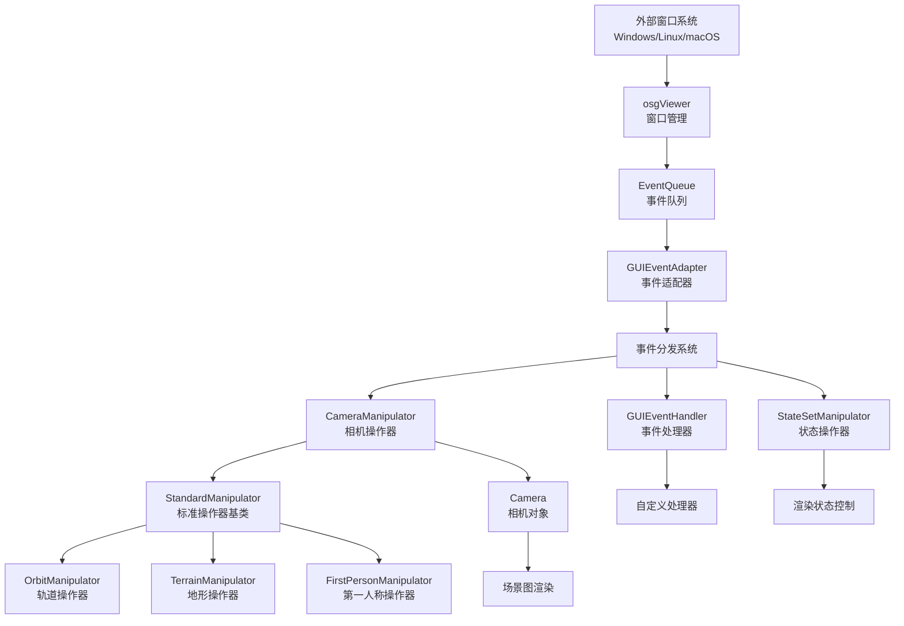
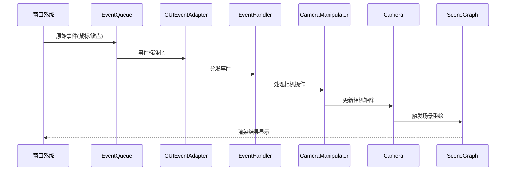
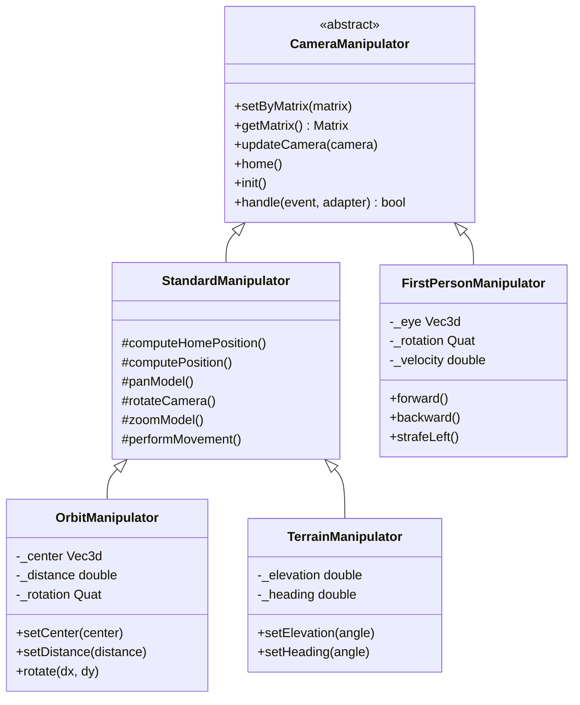
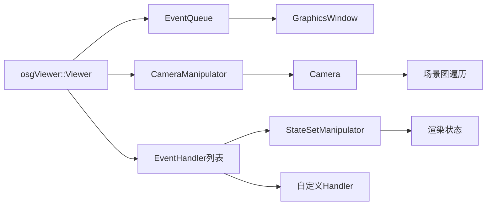

# osgGA 模块详细工作流程和结构分析

## 概述

osgGA (OpenSceneGraph GUI Adapter) 是OpenSceneGraph的核心交互模块，负责将用户输入事件转换为场景图操作。它是连接外部窗口系统、用户交互和OSG场景图的关键桥梁，提供了统一的事件处理框架和多样化的相机操作器。

## 整体架构图



## 核心工作流程

### 1. 事件处理总流程



### 2. 详细事件处理流程

#### 2.1 事件采集阶段
```cpp
// 在 osgViewer::GraphicsWindowWin32 中
void GraphicsWindowWin32::checkEvents()
{
    MSG msg;
    while (PeekMessage(&msg, _hwnd, 0, 0, PM_REMOVE))
    {
        switch(msg.message)
        {
            case WM_MOUSEMOVE:
                getEventQueue()->mouseMotion(msg.lParam & 0xFFFF, 
                                            (msg.lParam >> 16) & 0xFFFF);
                break;
            case WM_LBUTTONDOWN:
                getEventQueue()->mouseButtonPress(msg.lParam & 0xFFFF, 
                                                 (msg.lParam >> 16) & 0xFFFF, 1);
                break;
        }
    }
}
```

#### 2.2 事件队列处理
```cpp
// EventQueue 事件标准化过程
void EventQueue::mouseButtonPress(float x, float y, unsigned int button)
{
    _accumulateEventState->setEventType(GUIEventAdapter::PUSH);
    _accumulateEventState->setButton(button);
    _accumulateEventState->setX(x);
    _accumulateEventState->setY(y);
    _accumulateEventState->setTime(getTime());
    
    // 添加到事件队列
    addEvent(_accumulateEventState.get());
}
```

#### 2.3 事件分发机制
```cpp
// osgViewer::Viewer 事件分发
void Viewer::eventTraversal()
{
    // 获取事件队列中的事件
    osgGA::EventQueue::Events events;
    getEventQueue()->takeEvents(events);
    
    for(auto& event : events)
    {
        // 分发给所有事件处理器
        for(auto& handler : _eventHandlers)
        {
            if(handler->handle(*event, *this))
                break; // 如果事件被处理，停止继续分发
        }
    }
}
```

## 相机操作器详细机制

### 1. 相机操作器继承体系



### 2. OrbitManipulator 工作原理

#### 2.1 核心数据结构
```cpp
class OrbitManipulator : public StandardManipulator
{
protected:
    osg::Vec3d   _center;     // 旋转中心点
    osg::Quat    _rotation;   // 相机旋转四元数
    double       _distance;   // 到中心点距离
    
    // 鼠标交互状态
    float        _mouseCenterX, _mouseCenterY;
    osg::Vec3f   _previousUp;
    
    // 抛掷(throwing)动画
    bool         _thrown;
    osg::Vec2d   _throwDelta;
};
```

#### 2.2 事件处理流程
```cpp
bool OrbitManipulator::handle(const GUIEventAdapter& ea, GUIActionAdapter& us)
{
    switch(ea.getEventType())
    {
        case GUIEventAdapter::PUSH:
            return handleMousePush(ea, us);
        case GUIEventAdapter::DRAG:
            return handleMouseDrag(ea, us);
        case GUIEventAdapter::RELEASE:
            return handleMouseRelease(ea, us);
        case GUIEventAdapter::SCROLL:
            return handleMouseWheel(ea, us);
        case GUIEventAdapter::FRAME:
            return handleFrame(ea, us);
    }
    return false;
}
```

#### 2.3 旋转计算详解
```cpp
void OrbitManipulator::rotateWithFixedVertical(float dx, float dy)
{
    // 计算旋转轴和角度
    osg::Vec3d up = getUpVector(_coordinateFrame);
    osg::Vec3d right = getSideVector(_coordinateFrame);
    
    // 水平旋转（绕up轴）
    osg::Quat rotation_horizontal(dx * _rotationSensitivity, up);
    
    // 垂直旋转（绕right轴）
    osg::Quat rotation_vertical(dy * _rotationSensitivity, right);
    
    // 组合旋转
    _rotation = _rotation * rotation_horizontal * rotation_vertical;
    
    // 更新相机矩阵
    computePosition();
}
```

### 3. 相机矩阵计算

#### 3.1 从操作器参数到相机矩阵
```cpp
osg::Matrixd OrbitManipulator::getMatrix() const
{
    // 根据中心点、距离和旋转计算eye位置
    osg::Vec3d eye = _center + (_rotation * osg::Vec3d(0.0, 0.0, _distance));
    osg::Vec3d up = _rotation * osg::Vec3d(0.0, 1.0, 0.0);
    
    // 构建LookAt矩阵
    return osg::Matrixd::lookAt(eye, _center, up);
}

osg::Matrixd OrbitManipulator::getInverseMatrix() const
{
    // 相机的逆矩阵就是视图矩阵
    osg::Vec3d eye = _center + (_rotation * osg::Vec3d(0.0, 0.0, _distance));
    osg::Vec3d center = _center;
    osg::Vec3d up = _rotation * osg::Vec3d(0.0, 1.0, 0.0);
    
    return osg::Matrixd::lookAt(eye, center, up);
}
```

## 事件类型详细分析

### 1. 鼠标事件处理

#### 1.1 鼠标事件类型
```cpp
enum MouseButton {
    LEFT_MOUSE_BUTTON = 1,
    MIDDLE_MOUSE_BUTTON = 2, 
    RIGHT_MOUSE_BUTTON = 3
};

enum EventType {
    PUSH,           // 鼠标按下
    RELEASE,        // 鼠标释放
    DOUBLECLICK,    // 双击
    DRAG,           // 拖拽
    MOVE,           // 移动
    SCROLL          // 滚轮
};
```

#### 1.2 鼠标坐标系统
```cpp
// 窗口坐标系转换
void EventQueue::setMouseInputRange(float xMin, float yMin, float xMax, float yMax)
{
    _mouseXMin = xMin;
    _mouseYMin = yMin;
    _mouseXMax = xMax;
    _mouseYMax = yMax;
    _useFixedMouseInputRange = true;
}

// 标准化坐标计算
float EventQueue::normalizeMouseX(float x) const
{
    if (_useFixedMouseInputRange)
        return (x - _mouseXMin) / (_mouseXMax - _mouseXMin) * 2.0f - 1.0f;
    else
        return x;
}
```

### 2. 键盘事件处理

#### 2.1 按键事件结构
```cpp
enum Key {
    KEY_Space = 0x20,
    KEY_0 = '0', KEY_1 = '1', // ... KEY_9 = '9',
    KEY_A = 'A', KEY_B = 'B', // ... KEY_Z = 'Z',
    KEY_a = 'a', KEY_b = 'b', // ... KEY_z = 'z',
    
    KEY_Left = 0xFF51,
    KEY_Up = 0xFF52,
    KEY_Right = 0xFF53,
    KEY_Down = 0xFF54,
    
    KEY_F1 = 0xFFBE,    // F1 功能键
    KEY_F2 = 0xFFBF,    // ... F12
    
    KEY_Shift_L = 0xFFE1,
    KEY_Shift_R = 0xFFE2,
    KEY_Control_L = 0xFFE3,
    KEY_Control_R = 0xFFE4,
    KEY_Alt_L = 0xFFE9,
    KEY_Alt_R = 0xFFEA
};
```

#### 2.2 修饰键处理
```cpp
bool GUIEventAdapter::getModKeyMask() const
{
    int mask = 0;
    if (_modKeyMask & MODKEY_LEFT_SHIFT || _modKeyMask & MODKEY_RIGHT_SHIFT)
        mask |= MODKEY_SHIFT;
    if (_modKeyMask & MODKEY_LEFT_CTRL || _modKeyMask & MODKEY_RIGHT_CTRL)
        mask |= MODKEY_CTRL;
    if (_modKeyMask & MODKEY_LEFT_ALT || _modKeyMask & MODKEY_RIGHT_ALT)
        mask |= MODKEY_ALT;
    return mask;
}
```

## 多线程和性能优化

### 1. 线程安全机制

#### 1.1 事件队列线程安全
```cpp
class EventQueue : public osg::Object
{
protected:
    mutable OpenThreads::Mutex _eventQueueMutex;
    Events _eventQueue;
    
public:
    void addEvent(GUIEventAdapter* event)
    {
        OpenThreads::ScopedLock<OpenThreads::Mutex> lock(_eventQueueMutex);
        _eventQueue.push_back(event);
    }
    
    bool takeEvents(Events& events)
    {
        OpenThreads::ScopedLock<OpenThreads::Mutex> lock(_eventQueueMutex);
        if (_eventQueue.empty()) return false;
        
        events.splice(events.end(), _eventQueue);
        return true;
    }
};
```

### 2. 性能优化策略

#### 2.1 事件合并优化
```cpp
// 鼠标移动事件合并
void EventQueue::mouseMotion(float x, float y)
{
    // 检查最后一个事件是否也是鼠标移动
    if (!_eventQueue.empty())
    {
        GUIEventAdapter* lastEvent = _eventQueue.back().get();
        if (lastEvent->getEventType() == GUIEventAdapter::MOVE)
        {
            // 更新最后事件的坐标，而不是添加新事件
            lastEvent->setX(x);
            lastEvent->setY(y);
            lastEvent->setTime(getTime());
            return;
        }
    }
    
    // 添加新的移动事件
    addMouseEvent(GUIEventAdapter::MOVE, x, y, 0);
}
```

#### 2.2 矩阵计算缓存
```cpp
class CameraManipulator : public GUIEventHandler
{
protected:
    mutable bool _matrixDirty;
    mutable osg::Matrixd _matrix;
    
public:
    const osg::Matrixd& getMatrix() const
    {
        if (_matrixDirty)
        {
            _matrix = computeMatrix();
            _matrixDirty = false;
        }
        return _matrix;
    }
    
    void invalidateMatrix() { _matrixDirty = true; }
};
```

## 与其他模块的交互

### 1. 与 osgViewer 的集成



#### 1.1 Viewer中的事件处理循环
```cpp
void Viewer::frame(double simulationTime)
{
    if (_done) return;
    
    // 事件遍历
    eventTraversal();
    
    // 更新遍历
    updateTraversal();
    
    // 渲染遍历
    renderingTraversals();
}

void Viewer::eventTraversal()
{
    // 处理窗口事件
    checkEvents();
    
    // 更新相机操作器
    if (_cameraManipulator.valid())
    {
        _cameraManipulator->updateCamera(*_camera);
    }
}
```

### 2. 与 osg 核心的交互

#### 2.1 相机矩阵更新
```cpp
void CameraManipulator::updateCamera(osg::Camera& camera)
{
    camera.setViewMatrix(getInverseMatrix());
    
    // 如果支持自动计算近远裁剪平面
    if (getAutoComputeHomePosition())
    {
        computeHomePosition();
    }
}
```

#### 2.2 场景包围盒计算
```cpp
void StandardManipulator::computeHomePosition(const osg::Camera* camera)
{
    if (getNode())
    {
        osg::BoundingSphere boundingSphere = getNode()->getBound();
        
        // 根据包围球设置相机位置
        setHomePosition(
            boundingSphere.center() + osg::Vec3d(0.0, -3.5f * boundingSphere.radius(), 0.0),
            boundingSphere.center(),
            osg::Vec3d(0.0, 0.0, 1.0)
        );
    }
}
```

## 实际应用示例

### 1. 基本相机操作器设置

```cpp
#include <osgViewer/Viewer>
#include <osgGA/OrbitManipulator>
#include <osgGA/StateSetManipulator>
#include <osgGA/GUIEventHandler>

int main()
{
    osgViewer::Viewer viewer;
    
    // 设置轨道操作器
    osg::ref_ptr<osgGA::OrbitManipulator> manipulator = new osgGA::OrbitManipulator;
    manipulator->setAutoComputeHomePosition(true);
    manipulator->setHomePosition(
        osg::Vec3d(0, -10, 0),  // eye
        osg::Vec3d(0, 0, 0),    // center  
        osg::Vec3d(0, 0, 1)     // up
    );
    viewer.setCameraManipulator(manipulator);
    
    // 添加状态操作器（wireframe切换等）
    viewer.addEventHandler(new osgGA::StateSetManipulator(
        viewer.getCamera()->getOrCreateStateSet()));
    
    // 加载和显示场景
    osg::ref_ptr<osg::Node> scene = osgDB::readNodeFile("model.osg");
    viewer.setSceneData(scene);
    
    return viewer.run();
}
```

### 2. 自定义事件处理器

```cpp
class PickHandler : public osgGA::GUIEventHandler
{
public:
    virtual bool handle(const osgGA::GUIEventAdapter& ea, 
                       osgGA::GUIActionAdapter& aa)
    {
        if (ea.getEventType() == osgGA::GUIEventAdapter::DOUBLECLICK &&
            ea.getButton() == osgGA::GUIEventAdapter::LEFT_MOUSE_BUTTON)
        {
            // 获取拾取射线
            osgViewer::View* view = dynamic_cast<osgViewer::View*>(&aa);
            if (!view) return false;
            
            // 执行拾取
            osg::ref_ptr<osgUtil::LineSegmentIntersector> intersector = 
                new osgUtil::LineSegmentIntersector(
                    osgUtil::Intersector::WINDOW, ea.getX(), ea.getY());
            
            osgUtil::IntersectionVisitor iv(intersector.get());
            view->getCamera()->accept(iv);
            
            if (intersector->containsIntersections())
            {
                auto intersection = intersector->getFirstIntersection();
                osg::Vec3 point = intersection.getWorldIntersectPoint();
                
                std::cout << "拾取点: " << point.x() << ", " 
                         << point.y() << ", " << point.z() << std::endl;
                
                return true; // 事件已处理
            }
        }
        
        return false; // 继续传递事件
    }
};

// 使用：
viewer.addEventHandler(new PickHandler);
```

### 3. 自定义相机操作器

```cpp
class CustomManipulator : public osgGA::StandardManipulator
{
protected:
    osg::Vec3d _eye;
    osg::Vec3d _center; 
    osg::Vec3d _up;
    
public:
    virtual osg::Matrixd getMatrix() const
    {
        return osg::Matrixd::lookAt(_eye, _center, _up);
    }
    
    virtual osg::Matrixd getInverseMatrix() const
    {
        return osg::Matrixd::inverse(getMatrix());
    }
    
    virtual bool handle(const osgGA::GUIEventAdapter& ea,
                       osgGA::GUIActionAdapter& aa)
    {
        switch(ea.getEventType())
        {
            case osgGA::GUIEventAdapter::KEYDOWN:
                if (ea.getKey() == 'w' || ea.getKey() == 'W')
                {
                    // 向前移动
                    osg::Vec3d direction = _center - _eye;
                    direction.normalize();
                    _eye += direction * 0.1;
                    _center += direction * 0.1;
                    return true;
                }
                break;
        }
        
        return StandardManipulator::handle(ea, aa);
    }
};
```

## 调试和问题诊断

### 1. 常见问题和解决方案

#### 1.1 事件不响应
```cpp
// 检查事件处理器是否正确添加
void debugEventHandlers(osgViewer::Viewer& viewer)
{
    auto handlers = viewer.getEventHandlers();
    std::cout << "事件处理器数量: " << handlers.size() << std::endl;
    
    for (auto& handler : handlers)
    {
        std::cout << "处理器类型: " << handler->className() << std::endl;
    }
}
```

#### 1.2 相机操作不平滑
```cpp
// 启用抛掷动画以获得更平滑的交互
osg::ref_ptr<osgGA::OrbitManipulator> manipulator = new osgGA::OrbitManipulator;
manipulator->setAllowThrow(true);           // 启用抛掷
manipulator->setThrowDecayRate(0.05);       // 设置衰减率
manipulator->setAnimationTime(0.5);         // 设置动画时间
```

### 2. 性能监控

```cpp
class PerformanceHandler : public osgGA::GUIEventHandler
{
private:
    osg::Timer_t _lastFrameTime;
    unsigned int _frameCount;
    
public:
    PerformanceHandler() : _frameCount(0)
    {
        _lastFrameTime = osg::Timer::instance()->tick();
    }
    
    virtual bool handle(const osgGA::GUIEventAdapter& ea,
                       osgGA::GUIActionAdapter& aa)
    {
        if (ea.getEventType() == osgGA::GUIEventAdapter::FRAME)
        {
            _frameCount++;
            osg::Timer_t currentTime = osg::Timer::instance()->tick();
            
            if (_frameCount % 60 == 0)  // 每60帧报告一次
            {
                double deltaTime = osg::Timer::instance()->delta_s(_lastFrameTime, currentTime);
                double fps = 60.0 / deltaTime;
                
                std::cout << "FPS: " << fps << std::endl;
                _lastFrameTime = currentTime;
            }
        }
        
        return false;
    }
};
```

## 总结

osgGA模块是OpenSceneGraph中连接用户交互和场景渲染的关键桥梁。它通过以下几个方面实现了强大的交互功能：

1. **事件抽象**: 统一的事件模型处理各种输入设备
2. **相机控制**: 多样化的相机操作器满足不同应用需求  
3. **扩展性**: 良好的继承体系支持自定义扩展
4. **性能优化**: 事件合并、矩阵缓存等优化策略
5. **线程安全**: 多线程环境下的安全事件处理

理解osgGA的工作机制对于开发高质量的OSG应用程序至关重要，特别是在需要复杂用户交互的应用场景中。 